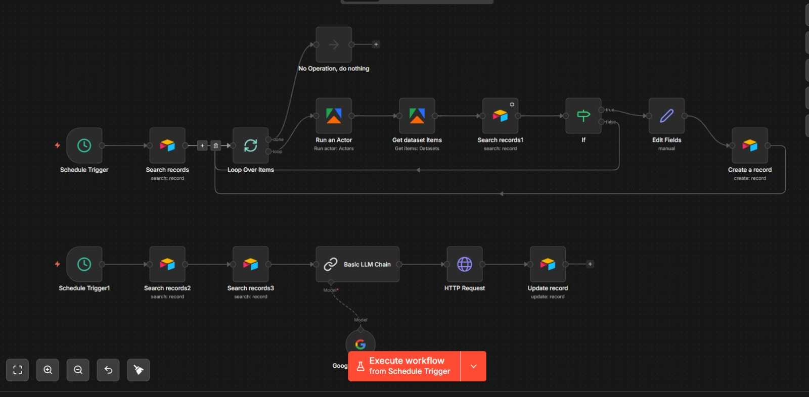

# LinkedIn AI Commenting Bot

An autonomous LinkedIn engagement system that discovers posts from target profiles, generates contextual AI comments using Gemini, and posts them directly to LinkedIn — fully automated, zero manual intervention.

Built with n8n, Apify, Airtable, Google Gemini 2.5 Flash, and Unipile.

---

## How it works

The system runs as two independent n8n workflow chains:

**Chain 1 — Post Discovery (runs daily)**
Scrapes recent posts from a list of LinkedIn profiles using Apify, checks for duplicates via URN matching in Airtable, and saves new posts with Status = `New`.

**Chain 2 — AI Comment Generation (runs every 2 hours)**
Picks up posts with Status = `New`, fetches the brand tone of voice from Airtable, generates a contextual comment using Gemini 2.5 Flash, posts it to LinkedIn via Unipile API, and updates the record to `Responded` — or `Failed` if the post was inaccessible.



---

## Tech Stack

| Tool | Purpose |
|---|---|
| n8n Cloud | Workflow orchestration |
| Apify | LinkedIn profile post scraper |
| Airtable | Database — profiles, posts, brand voice |
| Google Gemini 2.5 Flash | AI comment generation |
| Unipile | LinkedIn API bridge for posting comments |

---

## Features

- Fully automated end-to-end — no human input after setup
- URN-based deduplication prevents re-commenting on the same post
- Brand voice injection — per-client tone of voice from Airtable
- Error handling — failed Unipile calls marked as `Failed`, not silently dropped
- Multi-profile support — loops through any number of LinkedIn profiles
- ACA commenting framework — Acknowledge, Context, Action + Question
- Schedule-based triggering with natural time offsets

---

## Project Structure
```
linkedin-ai-commenting-bot/
├── workflow.json        # n8n workflow export (credentials replaced with placeholders)
├── airtable_schema.md   # Airtable base structure — tables, fields, field types
├── system_prompt.md     # Full AI system prompt used for comment generation
├── .env.example         # Environment variable template
├── CHANGELOG.md         # Build log and all fixes applied
├── architecture.png     # n8n workflow canvas screenshot
└── README.md
```

---

## Airtable Status Flow
```
New → Responded   (comment posted successfully)
New → Failed      (Unipile returned an error — post inaccessible)
```

Failed posts are not retried automatically. Review them in Airtable and delete or manually handle.

---

## AI Comment Framework

Comments follow the **ACA + Warm Question** structure:

- **Acknowledge** — affirm the core insight of the post
- **Context** — add a reframe or perspective that sharpens the idea
- **Action** — leave a practical takeaway
- **Question** — end with a genuine peer-to-peer question

Full prompt available in `system_prompt.md`.

---


## Built By

**Anunai Sai** — Final year B.Tech CS undergrad  
Interests: ML, AI Automation, n8n, Computer Vision, NLP  
[LinkedIn](https://www.linkedin.com/in/anunai/) • [GitHub](https://github.com/Anunai6966)
